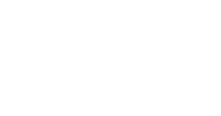
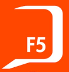

# Escape Room 404 - Factoría F5

***
## Table of Contents
- [Escape Room 404 - Factoría F5](#escape-room-404---factoría-f5)
  - [Table of Contents](#table-of-contents)
  - [General Information](#general-information)
  - [Screenshots](#screenshots)
  - [Technologies](#technologies)
    - [Backend Technologies](#backend-technologies)
    - [Frontend Technologies](#frontend-technologies)
  - [Installation](#installation)
    - [Backend Installation](#backend-installation)
    - [Frontend Installation](#frontend-installation)
  - [Versions](#versions)
    - [Plugins](#plugins)
  - [Deployment](#deployment)
  - [Support](#support)
  - [Authors](#authors)
  - [FAQs](#faqs)
  - [About the project](#about-the-project)
  - [Tools](#tools)
  - [Methodology](#methodology)
***
## General Information
Escape Room 404 is a virtual escape room designed by Factoria F5 to assess the competencies of candidates during their selection process. 

***

## Screenshots

<table>
<tr>
<td></td>
<td></td>
<td></td>
<td></td>
</tr>
<tr>
<td></td>
<td></td>
<td></td>
<td></td>
</tr>
<tr>
<td></td>
<td></td>
<td></td>
<td></td>
</tr>
<tr>
<td></td>
<td></td>
</tr>
</table>

***

## Technologies

The project was developed with the following technologies

### Backend Technologies

- Laravel Framework
- Laravel Sanctum
- Laravel Tinker
- Pusher PHP Server
- GuzzleHttp
- Tymon JWT Auth
- Postman

 

 

### Frontend Technologies

- Axios
- Bootstrap
- Framer Motion
- Prop-Types
- Pusher-js
- React
- React-Bootstrap
- React-DOM
- React-Hook-Form
- React-Router-DOM
- Styled-Components
- Sweetalert
- Vite-Plugin-Svgr
- Babel
- Jest

***

## Installation

### Backend Installation

To install and run the backend of Escape Room 404, please follow the steps below:

1- Ensure that you have PHP 8.0.2 or higher and Composer installed on your machine.

2- Clone the [repository from GitHub](https://github.com/fcegatti/escape-room-backend).

3- Navigate to the root directory of the project in your terminal.

4- Run `composer install` to install all the necessary dependencies.

5- Copy the .env.example file to a new file named .env, and update the configuration variables as needed.

6- Run `php artisan key:generate` to generate an application key.

7- Run `php artisan migrate` to run the database migrations.

8- To start the development server, use the command `php artisan serve`. This will start a local development server on http://localhost:8000/.

9- To build the project for production, you can use a tool like Laravel Forge or Laravel Envoyer to deploy your application to a production server. Alternatively, you can use a cloud hosting platform like Heroku to host your application.

### Frontend Installation

To install and run the frontend of Escape Room 404, please follow the steps below:

1- Ensure that you have Node.js installed on your machine. You can download it from the [official website](https://nodejs.org/en/download/).
2- Clone the [repository from GitHub](https://github.com/AleMCuitino/escape-room-frontend).
3- Navigate to the root directory of the project in your terminal.
4- Run `npm install` to install all the necessary dependencies.
5- To run the development server, use the command `npm run dev`. This will start a local development server on http://localhost:3000/.
6- To build the project for production, use the command `npm run build`. This will create a **dist** directory with the compiled code.
7- To preview the production build, use the command `npm run preview`.

***
## Versions

- Node.js: v14.16.1
- npm: 6.14.12
- React: 18.2.0
- Laravel: 9.19
- PHP: 8.0.2

### Plugins

- @vitejs/plugin-react: 3.1.0
- laravel-vite-plugin: 0.7.2
- vite-plugin-svgr: 2.4.0

***
## Deployment

  
[Visit our link](https://escape-room-backend-mcprj.ondigitalocean.app/api)

***

## Support

To handle any enquiries contact
>andres.patino@factoriaf5.org
***

## Authors

[Gary Lima](https://github.com/GaryHL) 
[Rodrigo Fernández](https://github.com/Rodrigo-ASJ)   
[Carla Luppi](https://github.com/carlaluppi)  
[Alejandra Morales Cuitiño](https://github.com/AleMCuitino)     
[federico gatti](https://github.com/fcegatti)

***
## FAQs

We'll fill this field when you ask something

## About the project

This project was developed as the final presentation of the P5.2022-23 class of the Full Stack bootcamp at Factoria F5.

## Tools

- Figma
- Notion
- GitHub
- Digital Ocean

## Methodology

* Agile and SCRUM.
* Pair programming.

